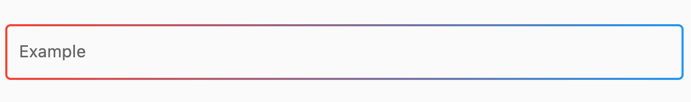
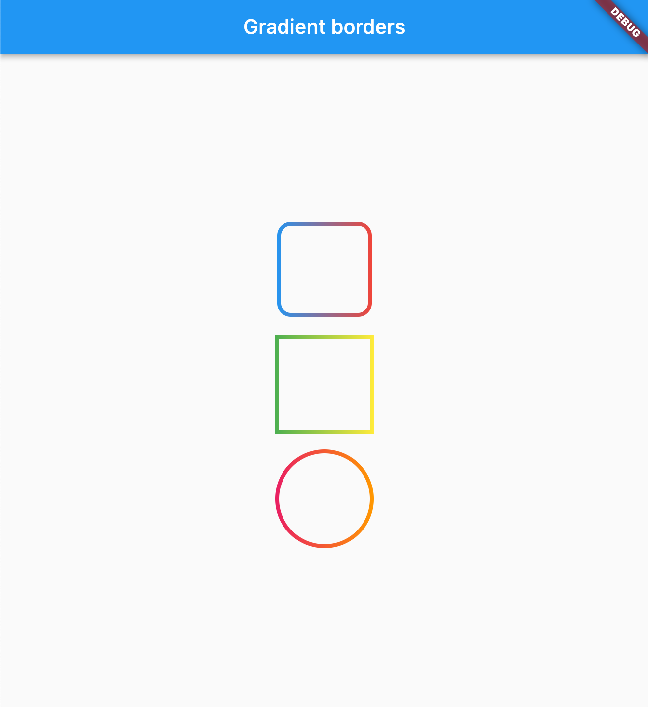

# 🌈 Gradient UI Plus

[](https://pub.dev/packages/gradient_ui_plus)
[](https://pub.dev/packages/gradient_ui_plus)
[](https://pub.dev/packages/gradient_ui_plus)

Gradient_ui_plus is a Flutter package that helps you easily add beautifully styled gradient-based UI widgets such as buttons, progress indicators, icon buttons, cards, and more — with minimal effort.

## 📷 Screenshots







## ✨ Features

- gradient_ui_plus is a Flutter package that helps you easily add beautifully styled gradient-based UI widgets such as buttons, progress indicators, icon buttons, cards, and more — with minimal effort.
🌟 Gradient versions of:
    - ElevatedButton, TextButton, FloatingActionButton
    - LinearProgressIndicator, CircularProgressIndicator
    - SelectableText, Icon, IconButton, Card
    - 💡 Pre-styled for plug & play.
    - 🎯 Supports both determinate and indeterminate progress indicators.
    - 🎨 Easily customizable gradients using Flutter's built-in Gradient class.

## 📦 Installation

Add the package to your `pubspec.yaml`:

```yaml
dependencies:
  gradient_ui_plus: ^latest_version
```

```sh
dependencies:
  flutter pub get
```


## 🚀 Usage
Import the package:
```dart
import 'package:gradient_ui_plus/gradient_ui_widgets.dart';
```

### 🔘 Gradient Buttons
```dart
GradientElevatedButton(
  onPressed: () {},
  gradient: LinearGradient(colors: [Colors.purple, Colors.pink]),
  child: Text("Click Me"),
);
```

With icon:
```dart
GradientElevatedButton.icon(
  onPressed: () {},
  gradient: LinearGradient(colors: [Colors.orange, Colors.yellow]),
  icon: Icon(Icons.star),
  label: Text("Starred"),
);
```

### 🕹️ Gradient FAB
```dart
GradientFloatingActionButton(
  onPressed: () {},
  gradient: LinearGradient(colors: [Colors.cyan, Colors.blue]),
  child: Icon(Icons.add),
);
```

extended:
```dart
GradientFloatingActionButton.extended(
  onPressed: () {},
  gradient: LinearGradient(colors: [Colors.teal, Colors.green]),
  icon: Icon(Icons.add),
  label: Text("Add Item"),
);
```

### 📊 Gradient Progress Indicators
Linear:
```dart
GradientLinearProgressIndicator(
  value: 0.6,
  valueGradient: LinearGradient(colors: [Colors.red, Colors.orange]),
);
```

Circular:
```dart
GradientCircularProgressIndicator(
  value: 0.8,
  valueGradient: LinearGradient(colors: [Colors.blue, Colors.green]),
);
```

### 📝 Gradient Selectable Text
```dart
GradientSelectableText(
  "Gradient Text",
  gradient: LinearGradient(colors: [Colors.purple, Colors.indigo]),
  style: TextStyle(fontSize: 24, fontWeight: FontWeight.bold),
);
```

### 🃏 Gradient Card
```dart
GradientCard(
  gradient: LinearGradient(colors: [Colors.deepPurple, Colors.indigo]),
  padding: EdgeInsets.all(12),
  child: Column(
    children: [
      Text("This is a gradient card", style: TextStyle(color: Colors.white)),
      Text("Stylish and clean", style: TextStyle(color: Colors.white)),
    ],
  ),
);
```

### 🔆 Gradient Icons
```dart
GradientIcon(
  Icons.favorite,
  gradient: LinearGradient(colors: [Colors.red, Colors.pink]),
  size: 50,
);
```

### 🧲 Gradient IconButton
```dart
GradientIconButton(
  icon: Icon(Icons.wifi),
  gradient: LinearGradient(colors: [Colors.blueGrey, Colors.cyan]),
  iconSize: 60,
  onPressed: () {},
);
```

### Box borders:

Change your container borders to use fancy gradients:
```dart
Container(
  width: 100,
  height: 100,
  decoration: BoxDecoration(
    border: const GradientBoxBorder(
      gradient: LinearGradient(colors: [Colors.blue, Colors.red]),
      width: 4,
    ),
    borderRadius: BorderRadius.circular(16)
  ),
),
```

### Input borders
You can use `GradientOutlineInputBorder` as a part of your input decoration:
```dart
TextField(
  decoration: InputDecoration(
    border: GradientOutlineInputBorder(
      gradient: LinearGradient(colors: [Colors.red, Colors.blue]),
      width: 2,
    ),
    focusedBorder: GradientOutlineInputBorder(
     gradient: LinearGradient(colors: [Colors.yellow, Colors.green]),
      width: 2
    ),
    label: Text("Example"),
  ),
),
```

### Input Underline borders 
```dart
TextField(
  decoration: InputDecoration(
    border: GradientOutlineInputBorder(
      gradient: LinearGradient(colors: [Colors.red, Colors.blue]),
      width: 2,
    ),
    focusedBorder: GradientUnderlineInputBorder(
     gradient: LinearGradient(colors: [Colors.yellow, Colors.green]),
      width: 2
    ),
    label: Text("Example"),
  ),
),
```

## 🛠️ Customization
All gradient widgets accept standard Gradient objects, such as LinearGradient, RadialGradient, etc. You can use your own colors, stops, angles, and more.

## 📄 License
This project is licensed under the MIT License. See the [LICENSE](https://github.com/deepak07082/gradient_ui_plus/blob/main/LICENSE) file for details.

## 💬 Contributing
Feel free to submit issues or pull requests. Contributions are welcome!

## 🌐 Author
Made with ❤️ by Deepak.